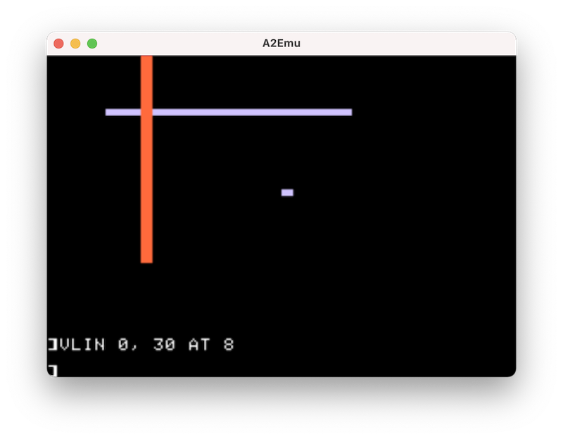
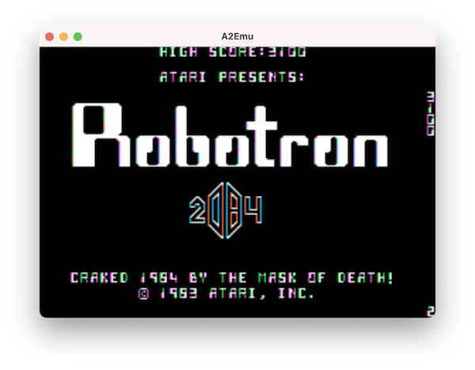

# Apple2TC

Convert classic Apple II games to runnable C code.

Apple2TC aims to decompile original Apple II binaries, mostly games, into
understandable and working modern C code, completely automatically by analyzing
the runtime behavior of the original code via custom software emulation.

The sound and graphics are the *original Apple II* sound and graphics,
implemented on top of modern libraries. So, games don't magically get higher
resolution or smoother frame rate. However, they run _natively_ (without
emulation) in the new environment they are built for.

The following series of blog posts describes the work on the project, as it
happens, in detail:

[Apple2TC: an Apple II Binary to C Decompiler - Part 1](https://tmikov.blogspot.com/2021/12/apple2tc-apple-ii-binary-to-c.html)

## Status

At this stage we are focusing on generating merely _working C code_ instead of
_readable C code_. The difference between the two is significant both in terms
of technical challenges and in readability of the result. However, we need to
learn to walk before we can fly: we need to prove that our system can extract
sufficient information from the original binary in order to recreate its full
functionality outside a CPU emulator.

Some things we have been able to successfully decompile and run so far:

- [Apple II BASIC](decoded/rom).
- [Robotron 2084](decoded/robotron).
- [Snake Byte](decoded/snake-byte).

Here is a video of the decompiled Snake Byte in action.

[](https://www.youtube.com/watch?v=5ALmzwyQjgM)

## Project Overview

The project consists of several components:

- [a2emu](https://tmikov.github.io/apple2tc/): an Apple2 emulator for running
  the original game and for *extracting and recording runtime knowledge about it
  based on dynamic behavior*.
- [a2io](lib/a2io): A library implementing Apple II sound and graphics. This
  library is used both by the emulator and by the generated C code.
- [id](tools/id): An interactive disassembler/binary editor for simple
  exploration of Apple II binary files.
- [a6502](tools/a6502): A 6502 symbolic assembler for easy experimentation. It
  can produce a bit accurate image of the Apple II ROM.
- [apple2tc](tools/apple2tc): The actual decompiler! It starts with a jump
  tracing 6502 disassembler augmented with runtime code coverage data from the
  emulator, an assembly listing generator, and the "Simple C" backend.

## a2emu: Apple II Emulator

- Source: https://github.com/tmikov/apple2tc/tree/master/tools/a2emu
- Online version: https://tmikov.github.io/apple2tc/ . Use F1 and F2 to load and
  run example games.




A2emu is portable and should work on MacOS, Linux, Windows and Web, although as
of this writing only MacOS and Web are regularly tested.

It is not intended to be a fancy all-powerful Apple II emulator, with bells and
whistles, all possible emulated hardware support, super precise timing, etc. Our
goal here is to generated runnable C code, not to emulate the Apple II. Plus,
there are many existing Apple II emulators, and one more is not really that
exciting or useful on its own.

With that said, A2emu is very simple, extremely easily buildable (has no
external dependencies!), and portable across many platforms, which puts it in a
fairly unique space.

Status:

- All tested non-disk games work. For convenience, two games, Bolo and Robotron
  2084, are packaged in the emulator and can be executed with F1/F2. Other games
  can be loaded by passing to the emulator on the command line.
- Applesoft Basic works.
- Text, GR and HGR, keyboard working.
- Sound works (but on web the user needs to interact with the page first due
  to https://developer.chrome.com/blog/autoplay/).
- Elaborate runtime data collection for Apple2TC.

Missing:

- Colors in HiRes mode need some improvement.
- The emulator code is not super flexible in how it handles IO, since this is
  not supposed to be a very powerful emulator.
- Tape support (we may add it soon, because it seems simple and may be a
  convenient way to save restore).
- Disk support. No plans to add it for now, since it appears to be a non-trivial
  amount of work and does not seem to be strictly necessary for the project. Who
  knows, perhaps inspiration will strike, or someone will decide to contribute
  it.

## Interactive Disassembler

[tools/id](tools/id)

For now we have implemented a simple interactive disassembler for initial
investigation of binaries.

It supports disassembling, dumping of data, and jumping around the memory. It
knows about builtin Apple II symbols.

## Assembler

[tools/a6502](tools/a6502)

`a6502` is a simple two pass assembler. No effort to optimize it has been made,
specifically it creates lots of `std::string`
instances. Should have probably used `std::string_view` instead, but I forgot
that I was building with C++17 and it was available.

It supports all directives found in APPLE2.LST. I didn't bother understanding
Merlin's awkward semantics for `ASC`, etc, but ensured that the present use
cases work.

Correctness should be good, except for overflowing the 16-bit PC, which I didn't
bother checking for.

## Building

The project uses CMake. It is designed to be portable and should work on MacOS,
Linux, Windows and Web. As of this writing only MacOS, Web and Linux builds work,
and only MacOS and Web are regularly tested.

### MacOS

No additional library dependencies should be needed.
```shell
git clone https://github.com/tmikov/apple2tc.git
cd apple2tc
mkdir build && cd build
cmake ..
make -j
```

### Linux

The build has been tested on Ubuntu 18.02 LTS, but the build instructions should
be similar for other distributions.

The project requires c++17, which is not fully supported by gcc versions before 8.
The default compiler on Ubuntu 18.02 is gcc 7.5.0, so  a later version needs to be
installed first:
```shell
sudo apt-get install gcc-8 g++-8
```

To override the default compiler used by CMake, the following environment
variables need to be exported *in the shell used by CMake later*:
```shell
export CXX=g++-8
export CC=gcc-8
```

The following dependencies are needed:
```shell
sudo apt-get install libx11-dev libxi-dev libxcursor-dev \
  libasound2-dev mesa-common-dev libglvnd-dev
```

Finally, the build itself:
```shell
git clone https://github.com/tmikov/apple2tc.git
cd apple2tc
mkdir build && cd build
cmake ..
make -j
```
